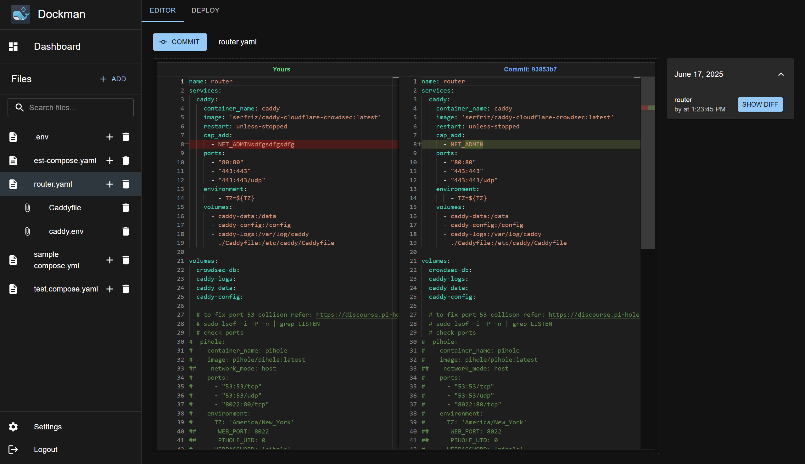
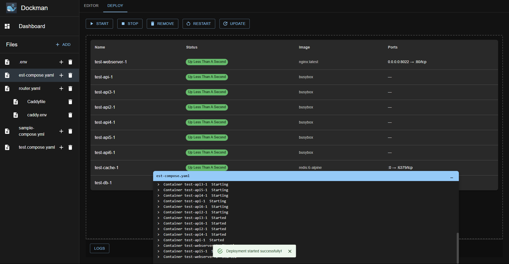

# Dockman

**⚠️ Warning: This software is currently in alpha. While it works (I'm personally using it to manage my server), expect
bugs and breaking changes.**

Dockman is a tool designed to simplify the management of Docker Compose files,
particularly for homelab environments.
It provides a straightforward way to edit, track, and back up your compose configurations.

## Screenshots






## Table of Contents

- [Philosophy](#philosophy)
    - [How It Compares](#how-it-compares)
    - [Who It's For](#who-its-for)
- [Usage](#usage)
- [WIP Features](#wip-features)
- [Feedback](#feedback)
- [Contributing](#contributing)
- [License](#license)

## Philosophy

I created Dockman to fill a specific gap in my homelab workflow.
While excellent Docker management tools exist,
I needed something that aligned with my particular approach.

Dockman follows a simple, opinionated structure:

```
{purpose}-compose.yaml
├── supporting .env files
└── related configuration files
```

Example, if using caddy and crowdsec

UI will show:

```
router-compose.yaml
├── Caddyfile
├── .env
└── acquis.yaml
```

But internally everything is stored flatly

```
tree .

├── router-compose.yaml
├── Caddyfile
├── acquis.yaml
├── .env
```

No directories, no complex paths—everything in a flat folder.
This approach keeps everything organized and predictable,
making it easy to locate and manage your compose files.

## How It Compares

**vs. [Portainer](https://github.com/portainer/portainer)**: Dockman delivers a focused, minimalist experience designed
for homelabs. If you find Portainer's extensive feature set overwhelming and prefer a streamlined interface dedicated
specifically to compose file management, Dockman might be your solution.

**vs. [Dockge](https://github.com/louislam/dockge)**: The fundamental difference lies in editing philosophy. Dockman
embraces direct compose file editing—like working with your favorite text editor. Instead of UI-generated code, you get
hands-on control over your configurations.

The project takes inspiration from both these excellent tools.

## Who It's For

Dockman isn't for everyone, and that's by design. It's built for users who:

- Prefer direct file editing over GUI abstractions
- Want a clean, purpose-built interface
- Value simplicity over feature breadth

If this matches your workflow, I'd appreciate a star on the project.

Even if it doesn't, I'd love to hear your [feedback](#feedback).

## Usage

Use the following to get Dockman running.

It is very important that the path for your stacks directory is the same in the three locations marked below.

* 1️⃣ The host side of the volume (/path/to/stacks)
* 2️⃣ The container side of the volume (/path/to/stacks)
* 3️⃣ The path for the --cr command flag (/path/to/stacks)

All three must be identical for Dockman to locate and manage your compose files correctly.

```yaml
  dockman:
    container_name: dockman
    image: ghcr.io/ra341/dockman:dev
    volumes:
      #  1️⃣                 2️⃣
      - /path/to/stacks:/path/to/stacks
      - /var/run/docker.sock:/var/run/docker.sock
    command:
      - "./dockman"
      - "--ui=dist"
      #  3️⃣
      - "--cr=/path/to/stacks"
    ports:
      - "8866:8866"
    restart: always
```

## WIP Features

* **Easy Editing with LSP Support:** Integrated Language Server Protocol (LSP) for enhanced editing features like
  autocompletion and syntax validation.
* **Git Tracking:** Built-in Git support to track changes in your compose files, providing version history and easy
  rollbacks.
* **Painless Backup/Restore:** Simple, reliable commands for backing up and restoring your entire Docker Compose setup
  using git.

## Feedback

This project is in early stages, so any and all feedback is a huge help.
If you spot a bug, have an idea for a feature, or just want to share your thoughts, please open an issue.

I'd especially love to hear what you think about a couple of things:

* The File and Folder Structure
    * Right now, all the files are just stored in a flat structure.
    * It works, but if you have a better idea for how to organize everything, please open an issue and let me know!

* The UI
    * I'm not a UI expert, in fact I hate HTML/CSS in general. The current interface is mostly built by Material-UI and
      Gemini.
    * If you have ideas on how to make it look better or easier to use, I'm all ears. Feel free to open an issue with
      your suggestions.

## Contributing

Contributions are welcome. Please feel free to submit a pull request or open an issue to discuss proposed changes or
provide feedback.

## License

This project is licensed under the GNU General Public License v3.0. See the [LICENSE](LICENSE) file for details.
